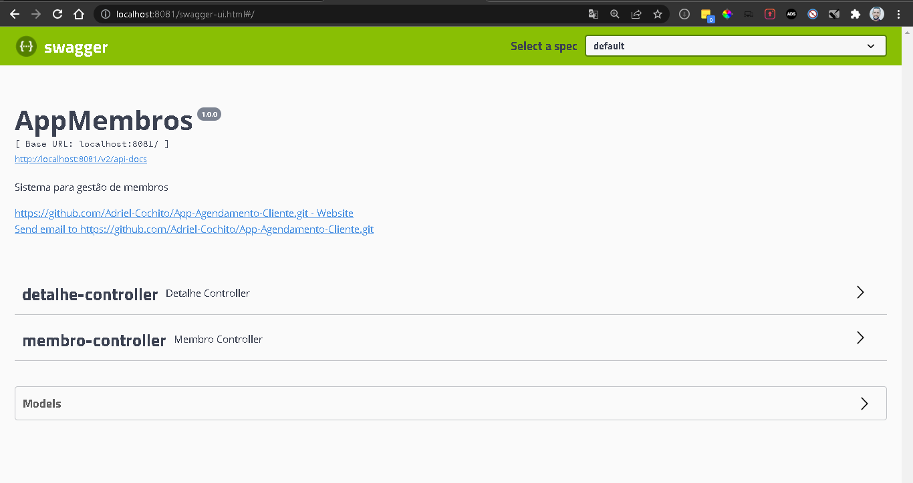
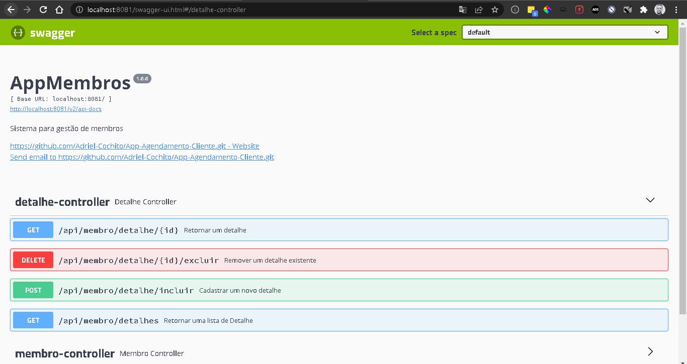
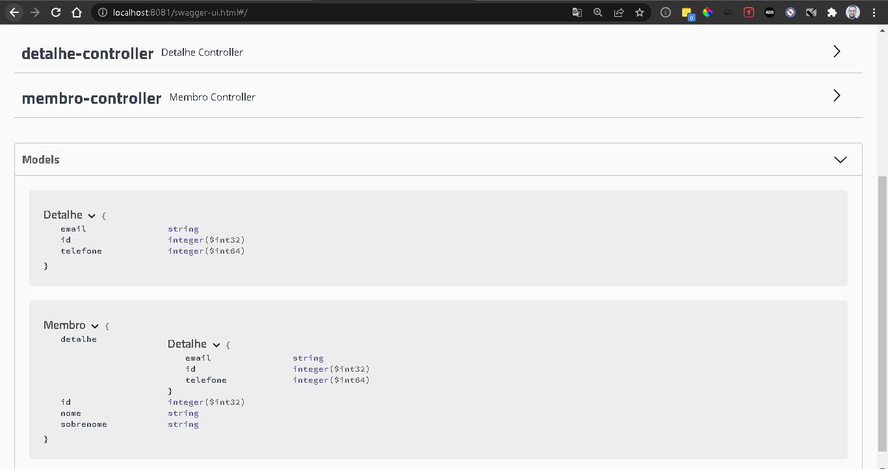

# App-Agendamento-Membros-API
API de membros/cliente para o App Agendamentos com Swagger

# Classes
- Membro
- Detalhe

# Atributos Detalhe

- Detalhe {
- email	string
- id	integer($int32)
- telefone	integer($int64)
}

# Atributos Membro

- Membro {
- detalhe	Detalhe
- id	integer($int32)
- nome	string
- sobrenome	string
}

## Tela inicial do Swagger da aplicação

## Tela de métodos da classe Detalhes do Swagger da aplicação

## Tela de métodos da classe Membros do Swagger da aplicação

## Tela de modelos do Swagger da aplicação

